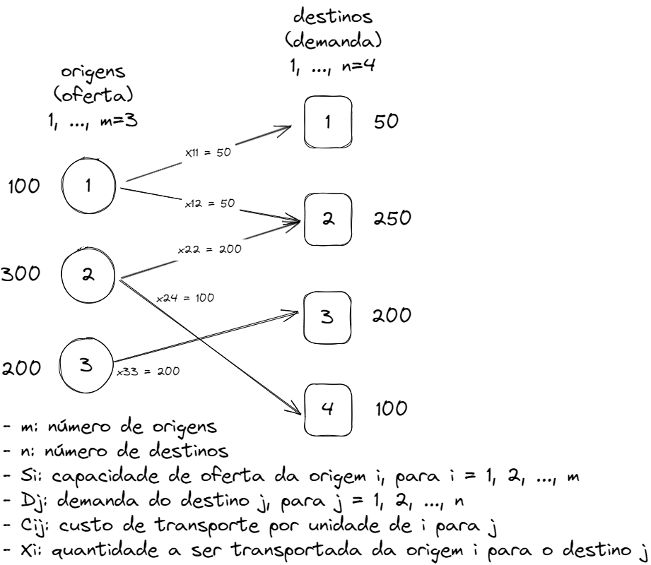

# ppgmne_mnum7125

Repositório que contém os arquivos utilizados por mim, como aluno, na disciplina de Implementação Computacional de Modelos de Programação Inteira Mista, no Mestrado do PPGMNE.

## Cronograma

| Data       | Semana | Conteúdo                                     | Atividade                |
|------------|--------|----------------------------------------------|--------------------------|
| 05/08/2024 | 1      | Introdução ao Gurobi com o Problema da Dieta | 1.1 e 1.2                |
| 06/08/2024 | 1      | Soluções das atividades 1                    | -                        |
| 12/08/2024 | 2      | Problema do Transporte                       | 2.1 e 2.2                |
| 13/08/2024 | 2      | Soluções das atividades 2                    | -                        |
| 19/08/2024 | 3      | ?                                            | 3                        |
| 20/08/2024 | 3      | Solução da atividade 3                       | -                        |
| 26/08/2024 | 4      | ?                                            | 4.1, 4.2, 4.3, 4.4 e 4.5 |
| 27/08/2024 | 4      | Solução das atividades 4                     |                          |
| 02/09/2024 | 5      | Problema do Caixeiro Viajante                | 5                        |
| 03/09/2024 | 5      | Solução das atividades 5                     |                          |
| 09/09/2024 | 6      | Caixeiro Viajante - Callback etc             | 6                        |
| 10/09/2024 | 6      | Solução da atividade 6 + PDP  (Pick Up and Deliv.)               |                          |

## Avaliação da disciplina

A avaliação será composta por duas partes:

1. Entrega de um artigo (maior nota)
2. Entrega de atividades (menor nota)

Sobre o artigo:

* O artigo deverá ser sobre a resolução de algum problema de forma detalhada e bem feita. Pode ser um problema feito em sala ou qualquer outro.
* Pode ser feito de forma individual ou em dupla.
* O tamanho do artigo é de 8 a 20 páginas, de forma mais curta.
* Seguir os templates dos artigos dessa revista: Computers and operations research
* A entrega será por volta da primeira semana de dezembro.

Sobre as atividades:

* Algumas aulas de terça-feira serão usadas para a realização de atividades que irão compor a nota final.
* É só não faltar nas aulas e entregar o que o professor solicita, mesmo que de maneira informal.

