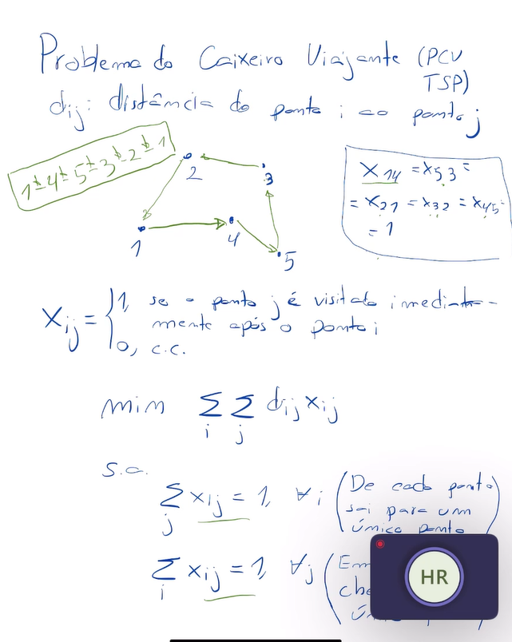
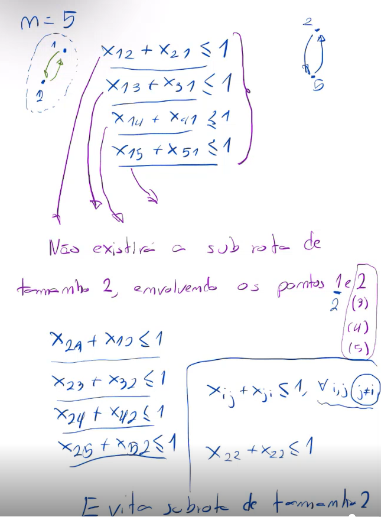
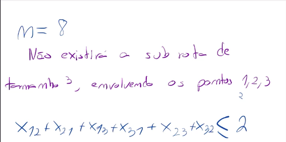

# Aula 5 - Problema do Caixeiro Viajante

## Índice

1. Descrição do Problema
2. Restrição de Subrotas
3. Atividade 5

## 1. Descrição do Problema

* $d_{ij}$: distância do ponto i ao ponto j
* $x_{ij}$: 1 se o ponto j é visitado imediatamente após o i, 0 caso contrário

$$ Min Z = \sum_{i}\sum_{j} d_{ij} \cdot x_{ij} $$

sujeito a:

* $ \sum_{j} x_{ij} = 1 \forall i $ (de cada ponto, sai um único destino)
* $ \sum_{i} x_{ij} = 1 \forall j $ (em cada ponto, chega rota de só uma origem)
* Restrição de não existir subrotas

Dizemos que existe uma subrota se o caixeiro fechar um ciclo passando por menos pontos do que o total.
Queremos detalhar essa restrição de não existir subrotas.

## 2. Restrição de Subrotas

Para escrever essa restrição, podemos dividir o problema principal em problemas menores:

* Evitar subrotas de tamanho 1
* Evitar subrotas de tamanho 2
* ...
* Evitar subrotas de tamanho n

Segue o esboço de como evitar subrotas de tamanho 2:

Segue o esboço de como evitar subrotas de tamanho 3:

* Observação: para evitar subrotas de tamanho 1, podemos escrever as restrições $x_{ii} = 0$ para todo $i$ ou podemos definir $d_{ii}$ muito grande para não incentivar essas subrotas unitárias.

Mas aqui, já vemos um problema: à medida que n cresce, teremos muitas restrições de subrotas.
Então, foi criado o método MTZ, que tem o seguinte intuito:

* Resolver o problema (sem restrições - no início - ou com as restrições escritas durante o processo)
* Identificar as subrotas que ocorreram
* Escrever as restrições para as subrotas que ocorreram
* Resolver o problema novamente com as novas restrições

Isso é repetido até que seja obtida uma solução que não tem subrotas.

O Método MTZ tem um ponto positivo e um negativo:

* Ponto positivo: consegue resolver o problema sem tantas restrições de subrotas, então o problema fica menos complexo
* Ponto negativo: precisa resolver o problema várias vezes até obter uma solução sem subrotas, o que pode ser caro computacionalmente

Por conta do ponto negativo, foram criados métodos que funcionam com callback, isto é, é possível resolver o problema adicionando mais algumas restrições sem ter que iniciar a solução do zero novamente.
Ou seja, o método guarda os parâmetros de uma execução e reutiliza-os na próxima execuçção, mesmo que ela tenha mais restrições.
Estudaremos sobre callback mais a seguir na disciplina.

## 3. Atividade 5

Implementar o Método MTZ em Python, mesmo que não fique de forma 100% automatizada.
Isto é:

* Implementar o problema do Caixeiro Viajante sem nenhuma restrição de subrotas
* Identificar as subrotas que ocorreram
* Escrever as restrições dessas subrotas que ocorreram
* Resolver o problema novamente
* Repetir isso até obter uma solução que não tenha subrotas
* Trazer a solução final ou parcial na aula do dia 03/09/2024, que iniciará às 8h15.
* O tempo das 7h30 às 8h15 da aula do dia 03/09/2024 poderá ser utilizado para discutir o problema com os colegas.